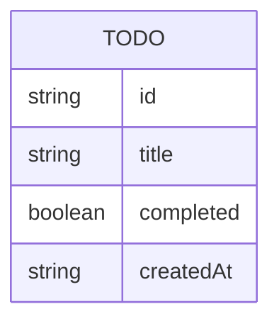

# Domain model

A single entity carries the whole product: a Todo, held in the API's memory
and shared by every visitor.

A `Todo` has a server-generated `id`, a required `title`, a `completed` flag
(defaults to false at creation and can be toggled either way), and a
`createdAt` timestamp set when it is made. There is no owner field — every
todo belongs to the one shared list.